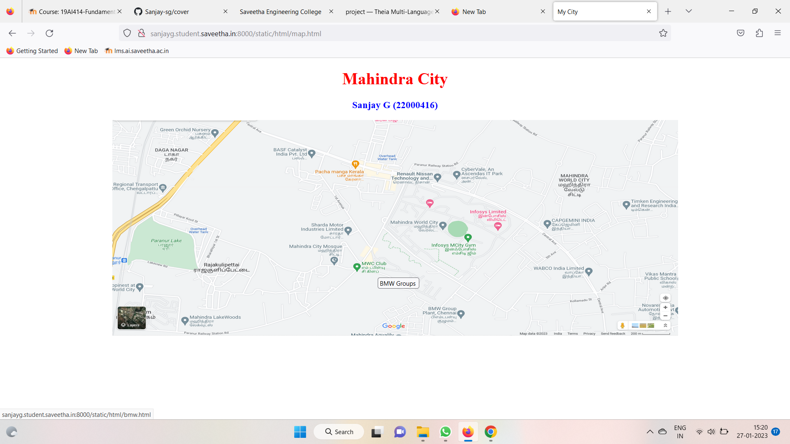
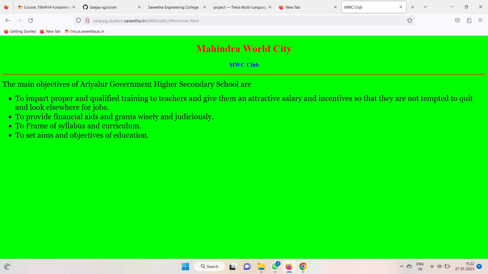
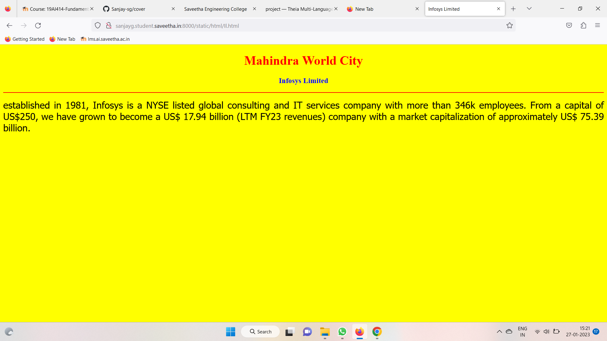
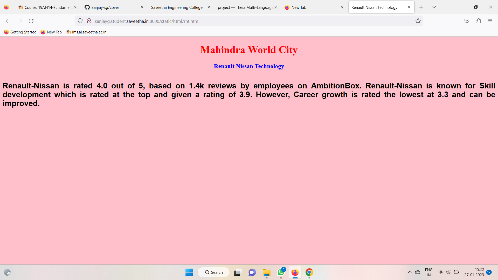
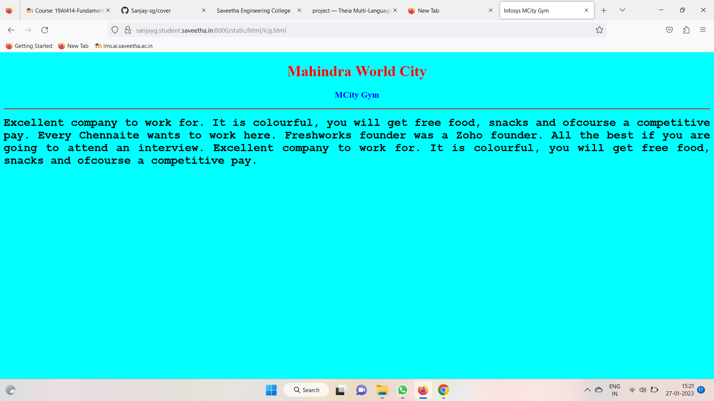

# Places Around Me
## AIM:
To develop a website to display details about the places around my house.

## Design Steps:

### Step 1:
Clone the github repository into Theia IDE.

### Step 2:
Create a new Django project

### Step 3:
write the needed html code.

### Step 3:
write the needed html code.

### Step 4:
Run the Django server and execute the HTML files.
## Code:
```
map.html

<!DOCTYPE html>
<html lang="en">
<head>
<title>My City</title>
</head>
<body>
<h1 align="center">
<font color="red"><b> Mahindra City </b></font>
</h1>
<h3 align="center">
<font color="blue"><b>Sanjay G (22000416)</b></font>
</h3>
<center>

<map name="MyCity">
<area shape="circle" coords="190,50,20" href="/static/html/icg.html" title=" MCity Gym ">
<area shape="rectangle" coords="230,30,260,60" href="/static/html/il.html" title="MCity Gym ">
<area shape="circle" coords="400,350,50" href="/static/html/rnt.html" title="Renault Nissan Technology  ">
<area shape="circle" coords="400,200,75" href="/static/html/mwc.html" title="MWC Club ">
<area shape="rectangle" coords="490,150,870,320" href="/static/html/bmw.html" title="BMW Groups ">
</map>
</center>
</body>
</html>

bmw.html

<!DOCTYPE html>
<html lang="en">
<head>
<title>BMW Groups </title>
</head>
<body bgcolor="orange">
<h1 align="center">
<font color="red"><b> Mahindra World City </b></font>
</h1>
<h3 align="center">
<font color="blue"><b> BMW Groups </b></font>
</h3>
<hr size="3" color="red">
<p align="justify">
<font face="Georgia" size="5">
BMW Group Plant Chennai started operations on 29 March 2007. 
<ol type="1">
<li> BMW Group Plant Chennai locally produces 12 car models.</li>
<li> BMW 2 Series Gran Coupe, BMW 3 Series,.</li>
<li> BMW 3 Series Gran Turismo, BMW 5 Series, BMW 6 Series.</li>
<li> BMW 7 Series, BMW X1, BMW X3, BMW X4, BMW X5, BMW X7 and MINI Countryman.</li>
</ol>
</font>
</p>
</body>
</html>

icg.html

<!DOCTYPE html>
<html lang="en">
<head>
<title>Infosys MCity Gym </title>
</head>
<body bgcolor="cyan">
<h1 align="center">
<font color="red"><b>Mahindra World City </b></font>
</h1>
<h3 align="center">
<font color="blue"><b> MCity Gym </b></font>
</h3>
<hr size="3" color="red">
<p align="justify">
<font face="Courier New" size="5">
<b>
Excellent company to work for.
It is colourful, you will get free food, snacks and ofcourse a competitive pay.
Every Chennaite wants to work here.
Freshworks founder was a Zoho founder.
All the best if you are going to attend an interview.
Excellent company to work for.
It is colourful, you will get free food, snacks and ofcourse a competitive pay.
</b>
</font>
</p>
</body>
</html>

il.html

<!DOCTYPE html>
<html lang="en">
<head>
<title>Infosys Limited </title>
</head>
<body bgcolor="yellow">
<h1 align="center">
<font color="red"><b> Mahindra World City </b></font>
</h1>
<h3 align="center">
<font color="blue"><b>Infosys Limited </b></font>
</h3>
<hr size="3" color="red">
<p align="justify">
<font face="Tahoma" size="5">
established in 1981, Infosys is a NYSE listed global consulting and IT services company with more than 346k employees. From a capital of US$250, we have grown to become a US$ 17.94 billion (LTM FY23 revenues) company with a market capitalization of approximately US$ 75.39 billion.</font>
</p>
</body>
</html>

mwc.html

<!DOCTYPE html>
<html lang="en">
<head>
<title>MWC Club </title>
</head>
<body bgcolor="lime">
<h1 align="center">
<font color="red"><b> Mahindra World City </b></font>
</h1>
<h3 align="center">
<font color="blue"><b>MWC Club </b></font>
</h3>
<hr size="3" color="red">
<p align="justify">
<font face="Georgia" size="5">
The main objectives of Ariyalur Government Higher Secondary School are 
<ul>
<li>To impart proper and qualified training to teachers and give them an attractive salary and incentives so that they are not tempted to quit and look elsewhere for jobs.</li>
<li>To provide financial aids and grants wisely and judiciously.</li>
<li>To Frame of syllabus and curriculum.</li>
<li>To set aims and objectives of education.</li>
</ul>
</font>
</p>
</body>
</html>

rnt.html

<!DOCTYPE html>
<html lang="en">
<head>
<title>Renault Nissan Technology </title>
</head>
<body bgcolor="pink">
<h1 align="center">
<font color="red"><b> Mahindra World City </b></font>
</h1>
<h3 align="center">
<font color="blue"><b> Renault Nissan Technology</b></font>
</h3>
<hr size="3" color="red">
<p align="justify">
<font face="Arial" size="5">
<b>
Renault-Nissan is rated 4.0 out of 5, based on 1.4k reviews by employees on AmbitionBox.
Renault-Nissan is known for Skill development which is rated at the top and given a rating of 3.9.
However, Career growth is rated the lowest at 3.3 and can be improved.
</b>
</font>
</p>
</body>
</html>
```

## Output:











## HTML Validator

## Result:
The program for implementing image map is executed successfully.